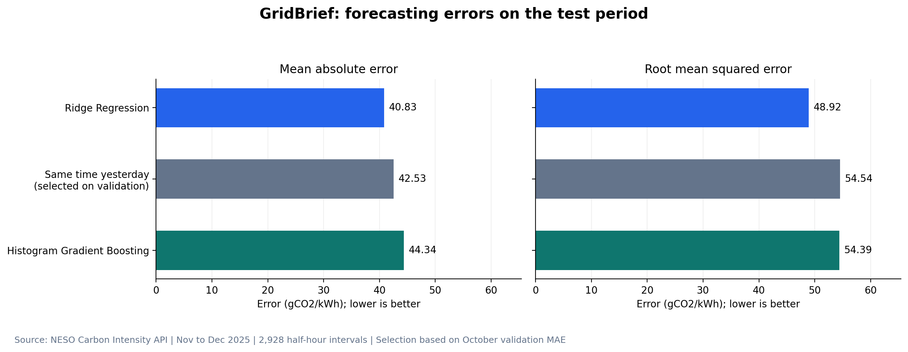
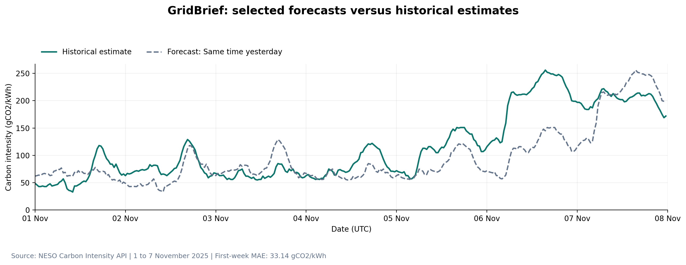
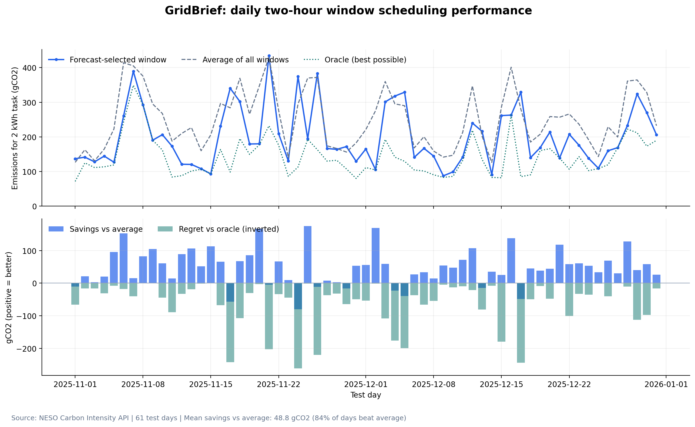
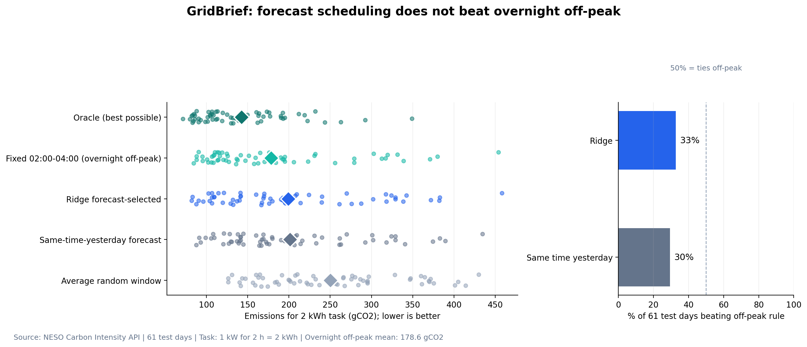
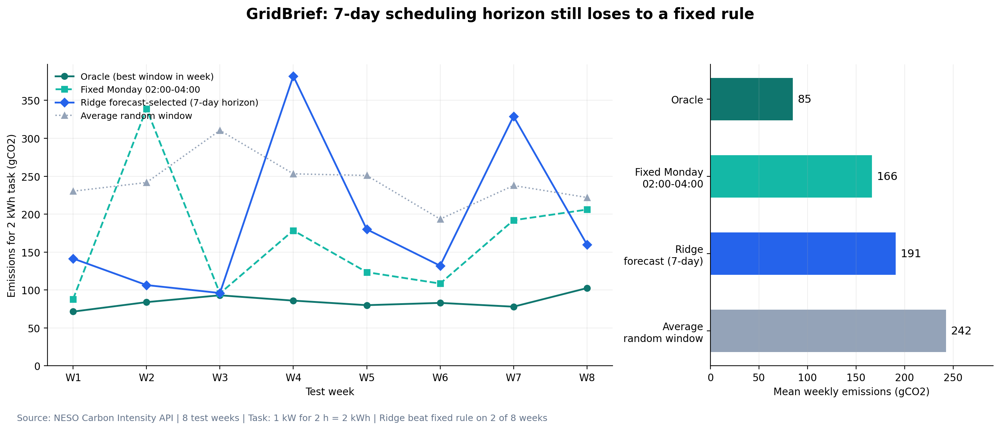
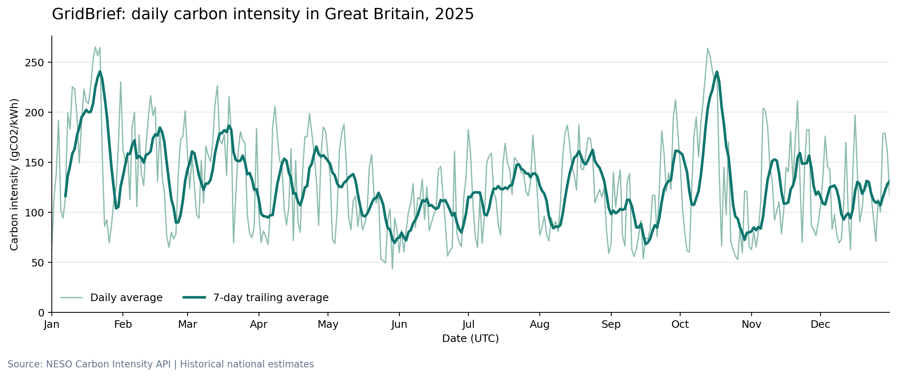
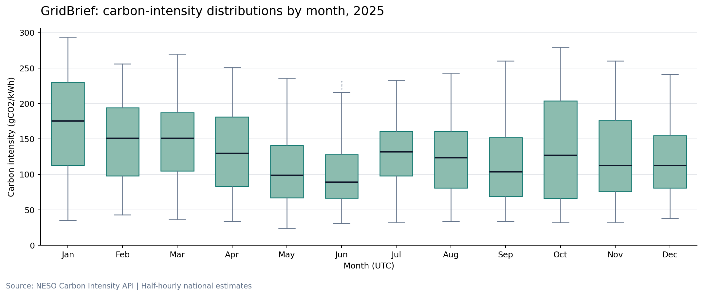
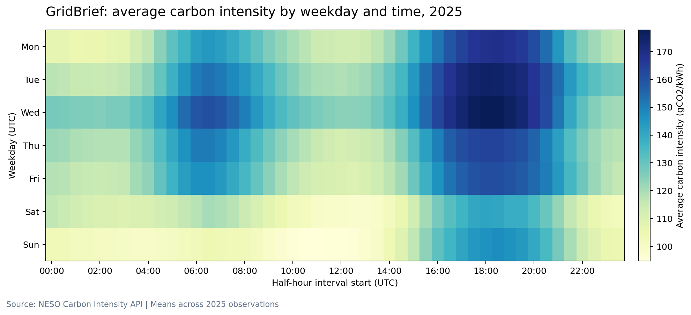

# GridBrief

**Forecasting GB grid carbon intensity, and testing whether the forecast is actually worth having.**


GridBrief forecasts half-hourly carbon intensity for the Great Britain electricity grid and uses those forecasts to schedule a 2 kWh deferrable household load (e.g. a dishwasher or EV charge) at the lowest-carbon two-hour window of the day.

## Headline finding

> **A carefully validated forecast does not beat a trivial fixed rule.**
>
> Ridge Regression had the lowest test-set MAE (**40.83 gCO2/kWh**) of the three methods tried. But when used to schedule the load, the best forecast-driven scheduler still lost to simply always charging at **02:00–04:00** — the GB grid's structural overnight low. Across 61 test days, the fixed off-peak rule averaged **178.6 gCO2** per 2 kWh task, beating every forecast method tested (189.7–201.3 gCO2 depending on method).

This is a negative result, and it's the point of the project: it shows *when* a forecasting model earns its complexity budget, and when it doesn't. See [Why the fixed rule wins](#why-the-fixed-rule-wins) below.

## What's in the repo

```
GridBrief-Forecasting/
├── notebooks/
│   └── gridbrief_forecasting_and_scheduling.ipynb   # full, executed pipeline
├── data/processed/
│   ├── gb_carbon_intensity_2025.csv                 # cleaned half-hourly series
│   └── model_dataset_2025.csv                       # engineered feature set
├── results/                                         # every metrics/predictions table the notebook produces
├── images/                                          # all 8 charts, regenerable from the notebook
├── requirements.txt
└── LICENSE
```

## Method

**Data.** Full-year 2025 half-hourly carbon intensity for Great Britain, pulled from the [NESO Carbon Intensity API](https://carbonintensity.org.uk/). 17,520 half-hour intervals, downloaded in 14-day batches with disk caching and retry logic. Data quality audit confirmed zero missing, duplicate, or malformed intervals.

**Features.** Lags at 1, 2, and 7 days; previous-day mean and standard deviation; cyclical (sin/cos) encodings for hour-of-day, day-of-week, and day-of-year; a weekend flag.

**No-leakage protocol.** The method is *selected* on a held-out validation month (October 2025) and *frozen* before the test period (November–December 2025) is touched:

| Split | Rows | Days | Period |
|---|---|---|---|
| Train | 12,768 | 266 | 8 Jan – 30 Sep 2025 |
| Validation | 1,488 | 31 | 1–31 Oct 2025 |
| Test | 2,928 | 61 | 1 Nov – 31 Dec 2025 |

Three methods were compared: a same-time-yesterday persistence baseline, Ridge Regression, and Histogram Gradient Boosting.

**Scheduling task.** Given a day's (or week's) forecast, place a constant 1 kW / 2-hour load at the window with the lowest predicted total emissions, starting on a half-hour boundary. Evaluated against an oracle (perfect hindsight), a naive average of all possible windows, and three fixed-time rules (overnight off-peak, midday solar peak, evening peak).

## Results

### Forecast accuracy

Validation selected the persistence baseline (lowest validation MAE) — but the test set shows that choice was suboptimal: Ridge actually generalized best.

| Model | Validation MAE | Test MAE | Selected on validation |
|---|---|---|---|
| Same time yesterday | 40.42 | 42.53 | ✅ |
| **Ridge Regression** | 42.56 | **40.83** | |
| Histogram Gradient Boosting | 46.27 | 44.34 | |

*(gCO2/kWh, lower is better)*




### Scheduling performance

Across all 61 test days, mean emissions for the 2 kWh task:

| Method | Mean emissions (gCO2) |
|---|---|
| Oracle (perfect hindsight) | 142.5 |
| **Fixed 02:00–04:00 off-peak** | **178.6** |
| Ridge-driven scheduler | 199.1 |
| Persistence-driven scheduler | 201.3 |
| Average of all windows | 250.1 |

The fixed off-peak rule beat the persistence-driven scheduler on 43 of 61 days, and beat the Ridge-driven scheduler on 41 of 61 days. Extending the scheduling horizon to a full week (8 test weeks) doesn't rescue it either — the fixed rule still wins, 166.4 vs. 190.9 gCO2 mean.





### Grid seasonality





## Why the fixed rule wins

GB demand is structurally lowest between 02:00 and 04:00, and overnight wind generation is often curtailed rather than displacing gas — so the grid's own published intensity series already encodes a strong, reliable low-carbon window at that time. A forecast only adds value if it can out-predict the prior that the fixed rule already captures. Ridge and the persistence baseline occasionally catch an unusually windy night better than the fixed window, but not consistently enough across a Nov–Dec test period to shift the average.

**What would likely change this result:** a longer test window spanning spring/summer (more solar, weaker overnight advantage), weather-driven features (wind speed, demand forecasts), or a longer-duration task where window placement matters more per kWh scheduled. None of those were in scope here.

## Reproducing this

```bash
pip install -r requirements.txt
jupyter notebook notebooks/gridbrief_forecasting_and_scheduling.ipynb
```

Run top to bottom. The notebook re-downloads and caches a full year of half-hourly data from the NESO Carbon Intensity API (no API key required), then reproduces every table in `results/` and every chart in `images/`.

## License

MIT — see [LICENSE](LICENSE).
